# Лабораторная работа: Установка Ubuntu в VirtualBox  

**Дата:** 22.09.2025  
**Студент:** Alexandr Pitropov  
**Группа:** I2302  

---

## 1. Установка VirtualBox
Для начала был скачан и установлен гипервизор VirtualBox.  
При установке использовались стандартные параметры мастера — они подходят большинству пользователей.  


---

## 2. Загрузка ISO-образа Ubuntu
Далее был загружен официальный дистрибутив Ubuntu 24.04.3 LTS с сайта [ubuntu.com](https://ubuntu.com).  
Файл был сохранён локально для последующей установки в виртуальной машине.  


---

## 3. Создание виртуальной машины
Через интерфейс VirtualBox была создана новая виртуальная машина с параметрами:  
- Тип ОС: **Linux**  
- Версия: **Ubuntu (64-bit)**  
- Имя: `Ubuntu_24.04_LTS`  

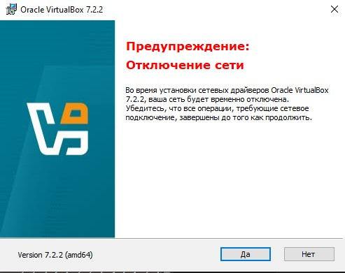

---

## 4. Настройка параметров ВМ
На данном шаге была выделена оперативная память и настроен виртуальный жёсткий диск:  
- RAM: 4096 МБ  
- HDD: VDI, динамический, 30 ГБ  

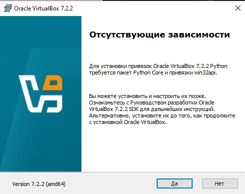

Также было выделено 2 процессорных ядра и увеличен объём видеопамяти до 128 МБ.  

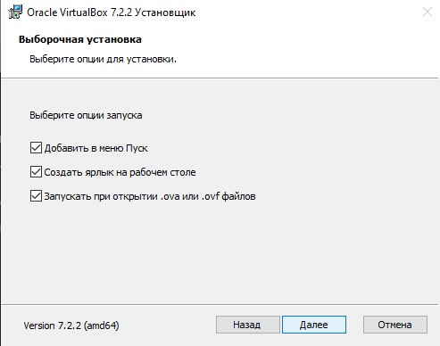

После этого ISO-образ Ubuntu был подключён в качестве загрузочного диска.  

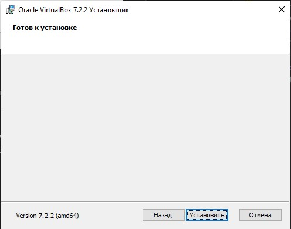

---

## 5. Запуск установки Ubuntu
Виртуальная машина была запущена, после чего выбран вариант **Install Ubuntu**.  

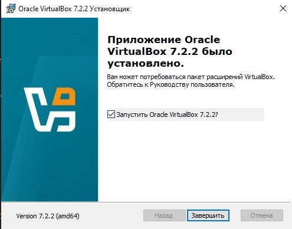

Выбор языка системы — **Русский** (хотя для шутки можно было поставить болгарский 😅).  

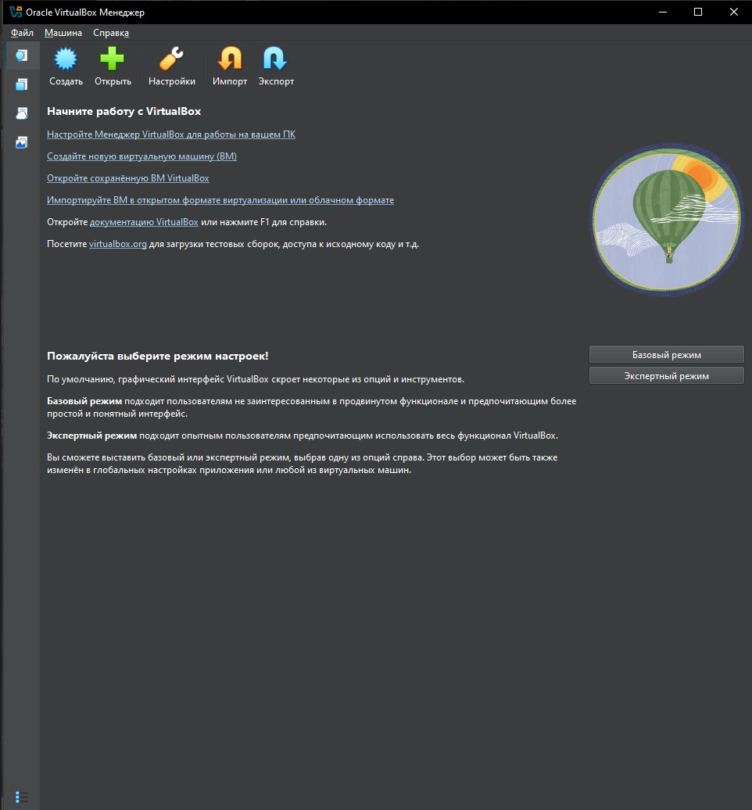

Настройка раскладки клавиатуры:  
- English (UK) — основная,  
- Русская — дополнительная.  

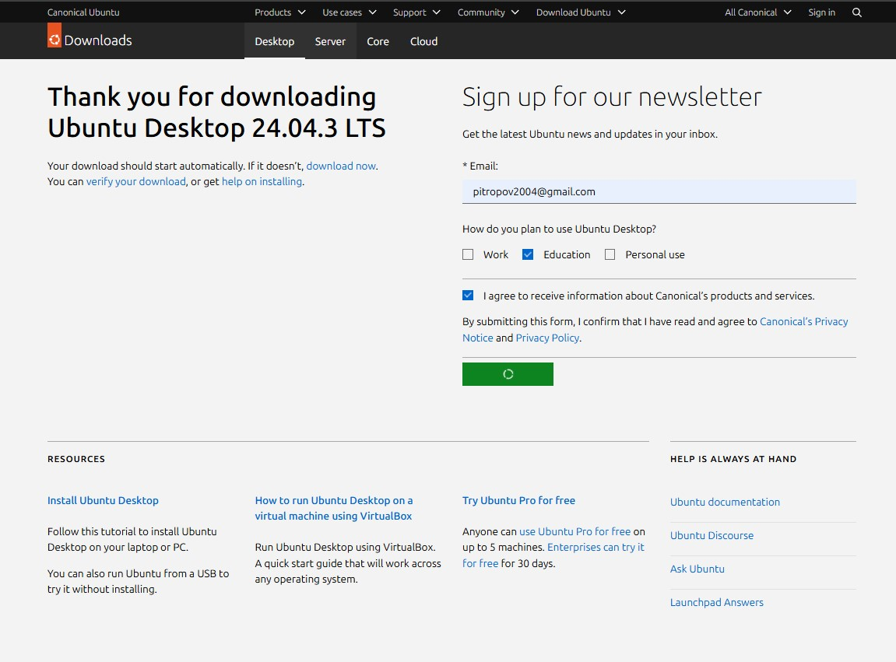

Выбрана стандартная установка (**Normal installation**) с загрузкой обновлений и проприетарных драйверов.  

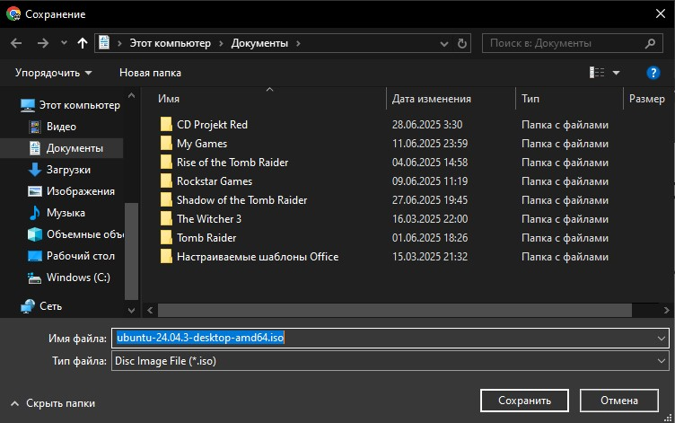

Разметка диска — автоматическая: **Erase disk and install Ubuntu (ext4)**.  


Часовой пояс установлен на **Chisinau (Europe/Chisinau)**.  


Создан пользователь:  
- Имя: **Alexander**  
- Компьютер: `alexander-VirtualBox`  
- Логин: `alexander`  
- Пароль: `1337`  

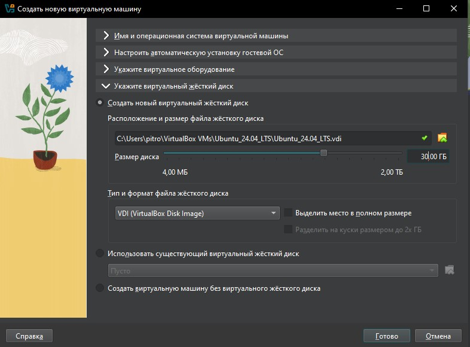

После подтверждения настроек началась установка системы.  

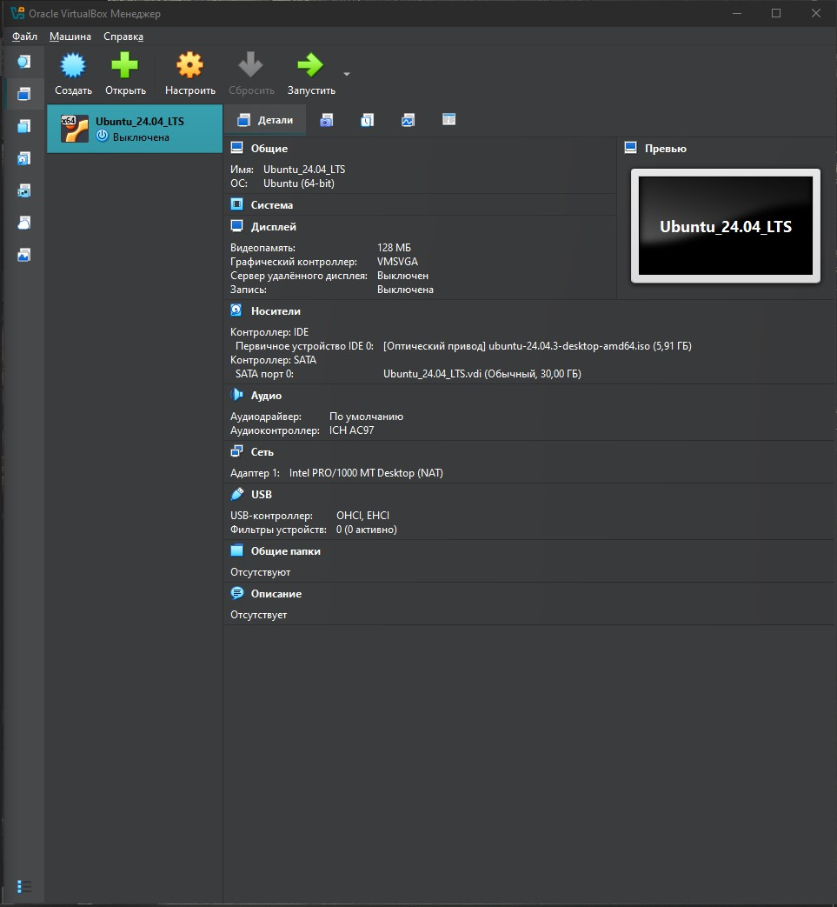

Затем последовала перезагрузка и первый вход в установленную систему.  

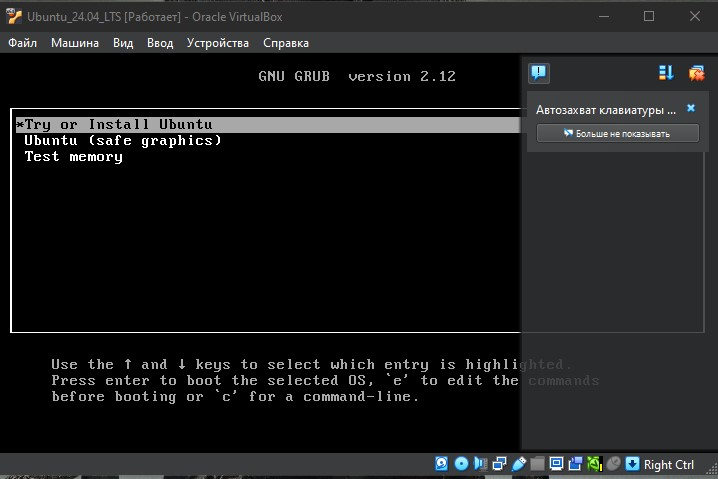

---

## 6. Первичная настройка Ubuntu
После входа в систему проведена базовая настройка.  
Интерфейс был оставлен на русском, хотя в процессе установки также рассматривался болгарский язык.  

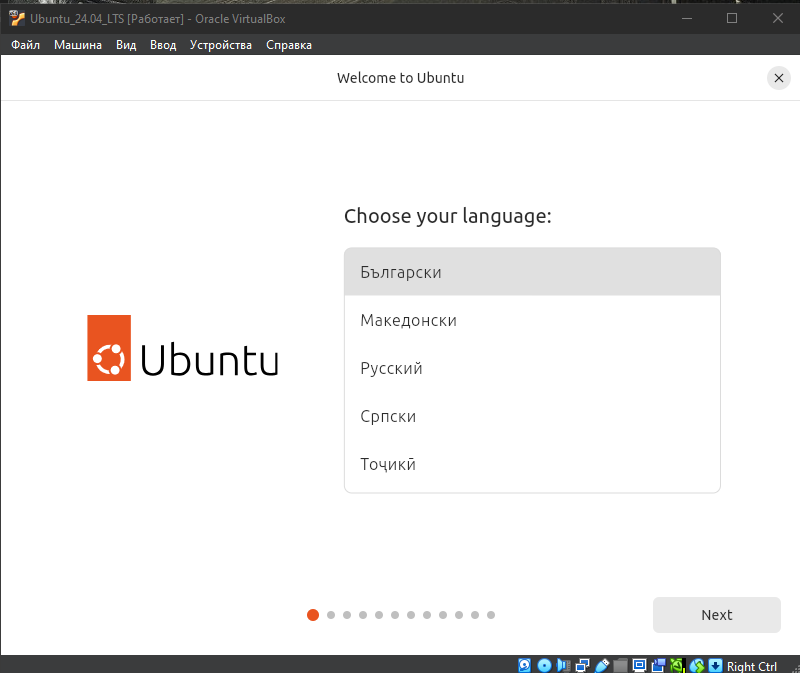

Система автоматически настроила сеть и основные сервисы.  

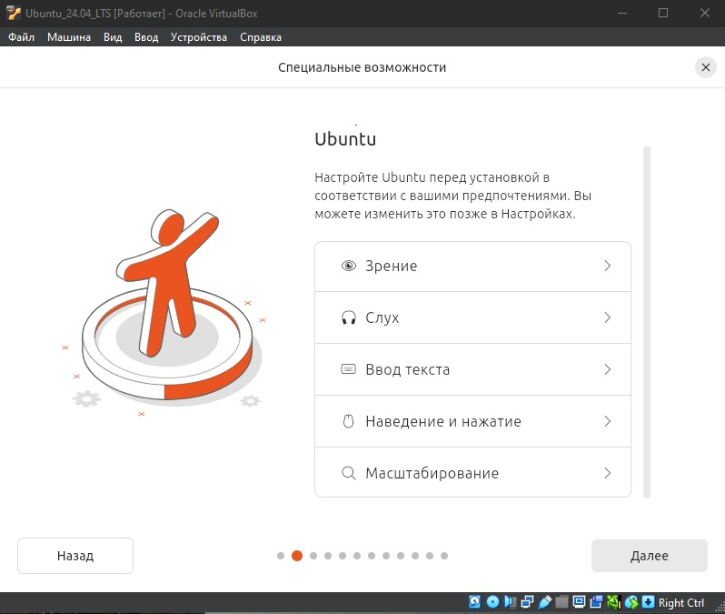

Далее через терминал были установлены обновления:
```bash
sudo apt update && sudo apt upgrade -y
```


---

## 7. Установка Guest Additions
Для лучшей интеграции виртуальной машины с хостом были установлены дополнения гостевой ОС:  
- поддержка динамического изменения разрешения,  
- общий буфер обмена,  
- оптимизация графики.  

```bash
sudo apt install -y build-essential dkms linux-headers-$(uname -r)
cd /media/$USER/VBox_GAs_*
sudo ./VBoxLinuxAdditions.run
sudo reboot
```

---

## Выводы
В рамках лабораторной работы была успешно установлена Ubuntu 24.04.3 LTS в среде VirtualBox.  
Были рассмотрены все ключевые этапы:  
- установка гипервизора,  
- загрузка ISO-образа,  
- создание и настройка виртуальной машины,  
- установка и первичная настройка ОС,  
- обновление системы,  
- подключение Guest Additions.  

В итоге виртуальная машина полностью готова к дальнейшей работе:  
можно запускать лабораторные работы, устанавливать дополнительное ПО и использовать Ubuntu для обучения и экспериментов.  

---
